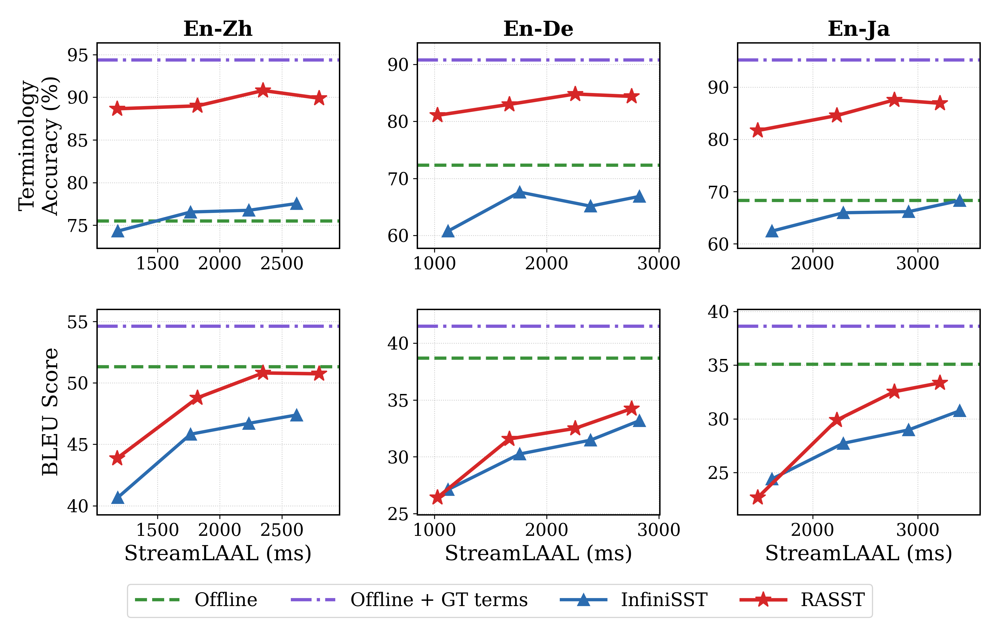
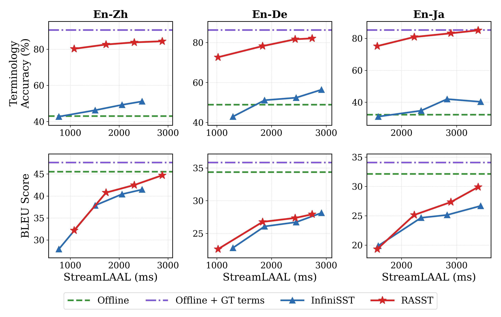

# RASST

This repository contains the release code, models, data links, and reproduction workflow for **RASST**, a retrieval-augmented streaming speech translation system for domain terminology.

The tracked paper PDF is [RASST](https://arxiv.org/abs/2601.22777).

## Main Results

RASST uses one global cache policy for all final main-result cells:

```text
lm=1,2 -> max_chunks=keep_chunks=30
lm=3,4 -> max_chunks=keep_chunks=20
```

On the final global-cache snapshot, RASST improves terminology accuracy over InfiniSST in all 24 evaluated cells, with positive BLEU deltas in 19/24 cells.

| Track | Avg. BLEU delta vs. InfiniSST | Avg. TERM_ACC delta vs. InfiniSST |
| --- | ---: | ---: |
| ACL6060 tagged | +1.911 | +0.170 |
| Medicine hard/raw | +1.564 | +0.358 |
| Overall | +1.737 | +0.264 |





The tracked result tables and figure sources are in [docs/results/main_result_global_cache30_30_20_20](docs/results/main_result_global_cache30_30_20_20/).

## Rebuttal 2026

Rebuttal 补实验的当前结论、provenance、artifact 状态和阻塞项统一记录在
[docs/results/rebuttal_2026](docs/results/rebuttal_2026/)；英文回复工作稿位于
[docs/rebuttal_2026_draft.md](docs/rebuttal_2026_draft.md)。所有标记为 `PENDING`
的数字都不能在生成并复核对应 artifact 前提交。

## Release Assets

| Asset | Link |
| --- | --- |
| Eval data: ACL6060 tagged, medicine, glossaries, audio | [gavinlaw/rasst-main-result-data](https://huggingface.co/datasets/gavinlaw/rasst-main-result-data) |
| Retriever checkpoint | [gavinlaw/rasst-retriever-hn1024](https://huggingface.co/gavinlaw/rasst-retriever-hn1024) |
| SLM en-de | [gavinlaw/rasst-speech-llm-de-cap16-denoise-ttag](https://huggingface.co/gavinlaw/rasst-speech-llm-de-cap16-denoise-ttag) |
| SLM en-ja | [gavinlaw/rasst-speech-llm-ja-cap16-denoise-ttag](https://huggingface.co/gavinlaw/rasst-speech-llm-ja-cap16-denoise-ttag) |
| SLM en-zh | [gavinlaw/rasst-speech-llm-zh-cap16-denoise-ttag](https://huggingface.co/gavinlaw/rasst-speech-llm-zh-cap16-denoise-ttag) |
| Baseline SLM (InfiniSST, no RAG) | [gavinlaw/rasst-infinisst-baseline](https://huggingface.co/gavinlaw/rasst-infinisst-baseline) |
| SLM SFT dataset (de/ja/zh, JSONL only) | [gavinlaw/rasst-speech-llm-sft-cap16-denoise-ttag](https://huggingface.co/datasets/gavinlaw/rasst-speech-llm-sft-cap16-denoise-ttag) |

Download all public release assets into ignored local paths:

```bash
git clone https://github.com/luojiaxuan/RASST.git
cd RASST

RASST_ALLOW_DOWNLOAD=1 bash code/rasst/scripts/download_release_data.sh --download
RASST_ALLOW_DOWNLOAD=1 bash code/rasst/scripts/download_release_assets.sh --download
```

This populates:

```text
data/         # eval inputs, glossaries, and referenced audio
checkpoints/  # SLM and retriever checkpoints
```

## Installation

The release scripts are written for Linux with CUDA GPUs. The reference cluster is Taurus, but the public assets can be downloaded on any machine that can run the required GPU stack. The pinned versions in [`requirements.txt`](requirements.txt) match the reference evaluation environment used for the reported results (Python 3.10, torch 2.9.0, vLLM 0.13.0, transformers 4.57.3, SimulEval 1.1.4).

```bash
conda create -n rasst -y python=3.10
conda activate rasst

# Default PyPI torch wheels are CUDA-enabled on Linux. For a specific CUDA
# build, install torch/torchvision/torchaudio first from the matching
# https://download.pytorch.org/whl/<cuXXX> index, then run the line below.
pip install -r requirements.txt
```

The eval/training scripts activate a conda env named `rasst` by default (via `CONDA_ENV_NAME`). If you use a different env name, `export CONDA_ENV_NAME=<your-env>` before launching.

### External tools (required for StreamLAAL term scoring)

Offline StreamLAAL / terminology scoring shells out to two external tools that are not pip-installable. Set them up once and point the eval driver at them (defaults are under `third_party/`, overridable via the env vars below):

```bash
# FBK-fairseq provides examples/.../simultaneous_translation/scripts/stream_laal_term.py
git clone https://github.com/hlt-mt/FBK-fairseq third_party/FBK-fairseq
export FBK_FAIRSEQ_ROOT="$PWD/third_party/FBK-fairseq"

# mwerSegmenter (sentence segmentation used during scoring); install per its
# own instructions into third_party/mwerSegmenter.
export MWERSEGMENTER_ROOT="$PWD/third_party/mwerSegmenter"
```

Some training launchers use the original Megatron/Swift Docker path. For exact SLM retraining, inspect the generated command first and run on a Slurm/Docker-capable GPU node.

## Evaluation And Inference

Validate that the manifest, downloaded data, checkpoints, and frozen result artifacts resolve:

```bash
bash code/rasst/scripts/eval_main_result.sh --validate-only --strict-metrics
```

Print all main-result eval commands without launching:

```bash
bash code/rasst/scripts/eval_main_result.sh --dry-run \
  --cache-chunks-by-lm 1:30/30,2:30/30,3:20/20,4:20/20
```

Print one cell only:

```bash
bash code/rasst/scripts/eval_main_result.sh --dry-run \
  --domain acl_tagged_raw --lang de --lm 3 \
  --cache-chunks-by-lm 1:30/30,2:30/30,3:20/20,4:20/20
```

Launch the full eval through Slurm after checking the dry run:

```bash
RASST_ALLOW_LAUNCH=1 bash code/rasst/scripts/eval_main_result.sh --sbatch \
  --cache-chunks-by-lm 1:30/30,2:30/30,3:20/20,4:20/20
```

### InfiniSST baseline (no RAG)

The paper's InfiniSST baseline reuses the same 24 cells, eval inputs, glossaries, and global cache policy as RASST, but disables retrieval. It is driven by a separate manifest and wrapper (`eval_baseline.sh`), which sets the no-RAG path in the serial driver:

```bash
# Validate the baseline manifest, model, inputs, and glossaries.
bash code/rasst/scripts/eval_baseline.sh --validate-only

# Print one baseline cell (a no-RAG SimulEval command, with no retriever/term-map args).
bash code/rasst/scripts/eval_baseline.sh --dry-run \
  --domain acl_tagged_raw --lang zh --lm 1 \
  --cache-chunks-by-lm 1:30/30,2:30/30,3:20/20,4:20/20

# Launch the full baseline through Slurm after checking the dry run.
RASST_ALLOW_LAUNCH=1 bash code/rasst/scripts/eval_baseline.sh --sbatch \
  --cache-chunks-by-lm 1:30/30,2:30/30,3:20/20,4:20/20
```

Because the baseline shares RASST's inputs and glossaries, the two manifests are directly comparable. See [docs/baseline_infinisst_no_rag.md](docs/baseline_infinisst_no_rag.md) for details.

By default, runtime outputs are written under ignored paths such as `outputs/`, `logs/`, `figures/`, and `checkpoints/`.

## Training

The release-facing SLM recipe is cap16 denoise-budget term tagging for `de`, `ja`, and `zh`. The wrapper is dry-run by default:

```bash
bash code/rasst/scripts/reproduce_slm.sh --lang all --stage all
```

Prepare data only:

```bash
bash code/rasst/scripts/reproduce_slm.sh --lang all --stage prepare
```

Print training commands only:

```bash
bash code/rasst/scripts/reproduce_slm.sh --lang all --stage train
```

Launch detached SLM data-prep/training jobs only after reviewing the printed commands:

```bash
RASST_ALLOW_LAUNCH=1 bash code/rasst/scripts/reproduce_slm.sh \
  --lang all --stage all --launch
```

The SFT training data (JSONL + stats only, audio held out) is published
separately. Stage it locally or download it with:

```bash
# Stage the JSONL-only dataset (audio paths rewritten to GigaSpeech-style keys).
bash code/rasst/scripts/upload_hf_slm_dataset.sh prepare

# Download the published dataset into data/slm_training/.
RASST_ALLOW_DOWNLOAD=1 bash code/rasst/scripts/upload_hf_slm_dataset.sh download --execute
```

Audio is not redistributed; reconstruct it from GigaSpeech. See [docs/slm_training_dataset.md](docs/slm_training_dataset.md).

Retriever training and MaxSim index construction are exposed separately:

```bash
bash code/rasst/scripts/train_retriever.sh --dry-run
bash code/rasst/scripts/build_index.sh --dry-run
```

Launch them only after checking paths and resources:

```bash
RASST_ALLOW_LAUNCH=1 bash code/rasst/scripts/train_retriever.sh
RASST_ALLOW_LAUNCH=1 bash code/rasst/scripts/build_index.sh
```

## Code Layout

The active release code lives under `code/rasst/`:

```text
code/rasst/slm/                  SLM data preparation and training launchers
code/rasst/retriever/            retriever training and MaxSim index/runtime code
code/rasst/eval/                 serial SimulEval eval, scorer, agent
code/rasst/analysis/main_result/ main-result table and figure builders
code/rasst/manifests/            release manifests
code/rasst/scripts/              public launch/download wrappers
```

`code/legacy/` is kept as frozen provenance from the original InfiniSST-derived
workspace. Batch/vLLM launchers are retained only for paper-canonical provenance
checks because batch and serial decoding can differ. New users should start with
the serial commands above rather than launching from `code/legacy/`.

## Contact

Please raise GitHub issues for questions about reproducing the release results.
