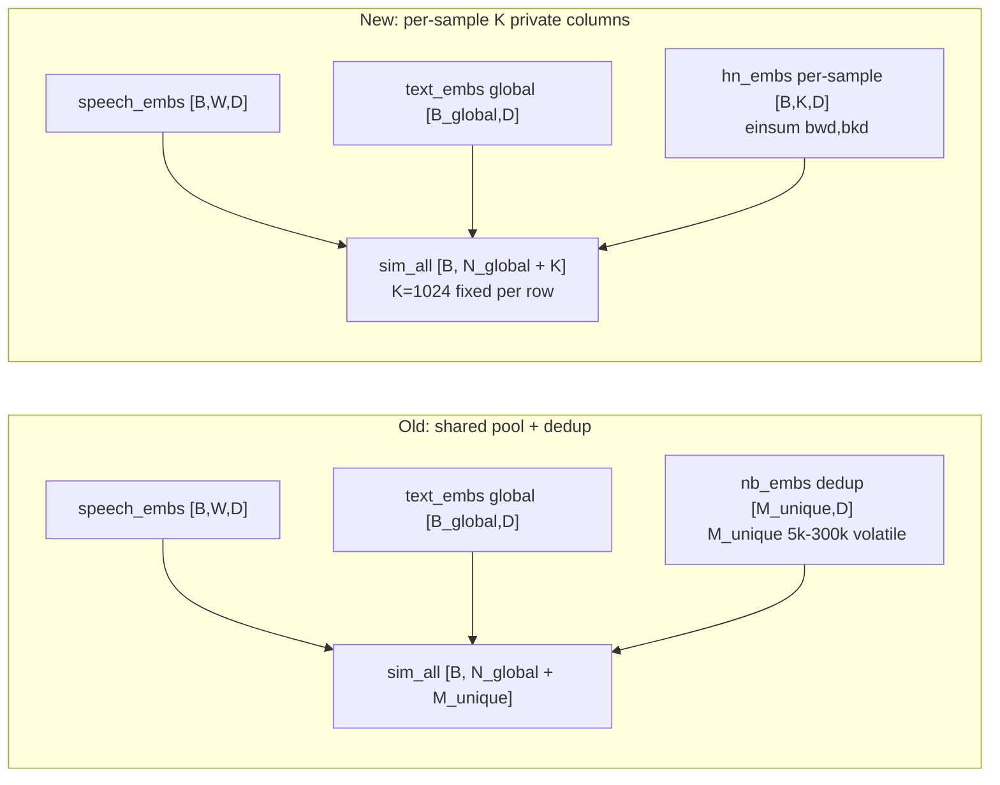

# Per-Sample Hard Negatives (K=1024) Switch

## Context

Previous hard-negative strategy (`--hard_neg_k`) mined top-K bank terms per
anchor and then **deduplicated across the batch** into a single shared
`[M_unique, D]` column block appended to the InfoNCE similarity matrix.
At `k >= 128` cold-start, `M_unique` inflated to 150-300k unique columns,
causing:

1. Cross-row contamination (row A's HN == row B's GT term) which forces
   large portions of the denominator into false-negative territory, weakening
   the InfoNCE gradient for ambiguous anchors.
2. Peak memory on the `speech_embs @ global_text_embs.T` matmul was
   proportional to `(N_inbatch + M_unique)` and scaled super-linearly once
   the `unique` bank exceeded `B_global`.
3. Empirically: cold-start runs at k=128/256/1024 (jobs 43820 / 43821 /
   43822) collapsed into `pos_sim ~= neg_sim` mode collapse within the first
   warmup window.

Advisor's suggestion at the weekly meeting: switch to **per-sample hard
negatives**. Each anchor mines its OWN top-K bank terms, and the similarity
matrix is extended by `K` per-row private columns (no cross-row sharing, no
dedup). The in-batch portion stays `B_global` (12288) regardless of K, and
per-row HN columns are realized by an einsum `bwd,bkd->bwk` that bypasses
the shared matmul entirely.

## Matrix semantic comparison

Under the new layout, row `i`'s columns `[N_global : N_global + K]` are its
own mined HN — no cross-row column sharing at all.

## Code changes

File: [qwen3_glossary_neg_train.py](../train/term_train/qwen3_glossary_neg_train.py)

1. CLI:
   - Added `--hard_neg_k_per_sample` (int, default 0) at L4328.
   - Added mutually-exclusive assert with `--hard_neg_k` at L4488.
2. Bank extension:
   - New `NegativeTermBank.mine_hard_negatives_per_sample` at L1090 — reuses
     the chunked `topk` loop of `mine_hard_negatives` but **skips the
     `unique()` dedup**, returning `(hn_embs[B,K,D], hn_tids[B,K], B*K)`.
3. Loss function:
   - Added `per_sample_neg_embs` / `per_sample_neg_term_ids` parameters to
     `compute_masked_contrastive_loss` (L1803).
   - New per-sample MaxSim helpers `_maxsim_score_per_sample` and
     `_maxsim_score_mfa_per_sample` (L1663 / L1695) — mirror their
     shared-N counterparts but operate on `hn_embs [B,K,D]` via
     `torch.einsum("bwd,bkd->bwk", ...)` instead of a global matmul.
   - After step 5.5 (`neg_mask`) and before step 6 (`masked_fill`), compute
     `hn_sim [B,K]`, concatenate to `raw_sim` / `logits`, and extend
     `pos_mask` / `fn_mask` / `neg_mask` with the HN block. The 1D
     `global_valid_mask` is promoted to a 2D `valid_row_mask` so HN columns
     can be individually masked.
   - CosFace margin, HCL, O-HNM, TCM, InfoNCE all operate on the extended
     matrix unchanged — only the mask shape changed from 1D broadcast to
     explicit 2D.
4. Training loops:
   - `gradcache_train_step` (L1179): new `elif getattr(args, "hard_neg_k_per_sample", 0) > 0` branch calls `mine_hard_negatives_per_sample` and passes `ps_embs` / `ps_tids` to the loss.
   - Non-gradcache path (L3815-equivalent): identical wiring.
5. `use_neg_bank` (L3263) now also triggers on `--hard_neg_k_per_sample > 0`.

Launcher: [run_hardneg_per_sample_k1024_cold_aries.sh](../train/term_train/run_hardneg_per_sample_k1024_cold_aries.sh)
- Cold start, 5 epoch, aries 8×A6000.
- `HARD_NEG_K=0`, `HARD_NEG_K_PER_SAMPLE=1024`.
- `GRAD_CACHE_CHUNK_SIZE=256` (unchanged; per-row HN adds ~3 GB bf16 on
  phase-2, comfortable within the 19 GB budget observed in pool-mode
  smoke).
- LR / TCM / MFA / MaxSim config identical to variant E baseline
  ([run_hardneg_k1024_aries.sh](../train/term_train/run_hardneg_k1024_aries.sh))
  so the comparison is apples-to-apples against the old pool-mode k=1024
  run.

## Smoke test (job 43825, MAX_STEPS=50)

Submit: `MAX_STEPS=50 sbatch run_hardneg_per_sample_k1024_cold_aries.sh`.

Observed in the first 40 steps on aries:

| step | loss | infonce | tcm_pos | tcm_neg | pos_sim | neg_sim | hard_negs |
|------|------|---------|---------|---------|---------|---------|-----------|
| 20 | 9.5618 | 9.3508 | 0.1841 | 0.0269 | 0.422 | 0.410 | 1,572,864 |
| 40 | 9.2043 | 9.0377 | 0.0617 | 0.1049 | 0.615 | 0.551 | 1,572,864 |

- `hard_negs = 1,536 × 1024 = 1,572,864` exactly (per-rank local count),
  confirming `mine_hard_negatives_per_sample` wires through correctly with
  no dedup.
- `infonce` monotonically decreases (9.35 → 9.04); `pos_sim / neg_sim`
  begin to separate at step 40 — the hallmark cold-start sanity signal that
  pool-mode k=1024 (job 43822) never produced.
- No NaN / OOM / stalls. Step time ~21 s/step after warmup.
- Eval @ step 40 on ACL6060 (645 samples, 95 GT terms): `recall@10 = 0.065`
  — not meaningful this early in cold-start (LR still in linear warmup at
  `2.57e-5`), but confirms the eval path runs cleanly through the extended
  loss code.

## Full run

Submitted as job **43827** (aries, RUNNING) after smoke 43825 landed clean.
Command: `sbatch run_hardneg_per_sample_k1024_cold_aries.sh` (no `MAX_STEPS`
override). Config confirmed from log: `EPOCHS=5 MAX_STEPS=0 HARD_NEG_K_PER_SAMPLE=1024`.

Budget: 5 epochs × 530 steps/epoch = 2650 steps at ~21 s/step ≈ 15-16 h
wall. SLURM time limit 28 h gives 2x margin.

Save path:
`/mnt/gemini/home/jiaxuanluo/train_outputs/q3rag_scale_lora-r128-tr128_bs12k_t=0.07_3var_clean_gc_wr1000k_m0.0_maxsim_mfa_variantE_hardneg_per_sample_k1024_tcm_ep5_cold.pt`

Wandb: `variantE_ps_k1024_*` run prefix in project `qwen3_rag`.

## Expected comparisons

Primary metric: `eval_acl6060/recall@10_gs10000` (OOD, 10k glossary).
- Old pool k=64 (job 43800 variantE ep5 best): ~0.87 @ best
  (`*_best_acl6060_gs10000.pt`).
- Old pool k=1024 cold (job 43822): collapsed ~step 200, never recovered.
- New per-sample k=1024 cold: target **>= 0.87** at matching step count,
  with a further OOD gain if the decontaminated negative geometry does what
  we think it does.

If per-sample k=1024 beats the k=64 baseline on ACL6060 gs10000, scale up to
K=4096 in a follow-up (per-row matmul memory is linear in K, so K=4096 fits
~12 GB hn_embs well within the 48 GB A6000 budget).
